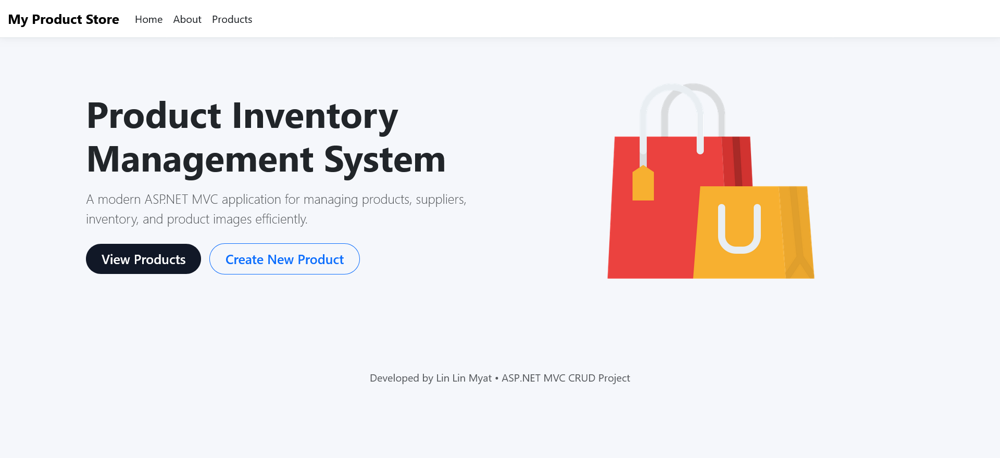
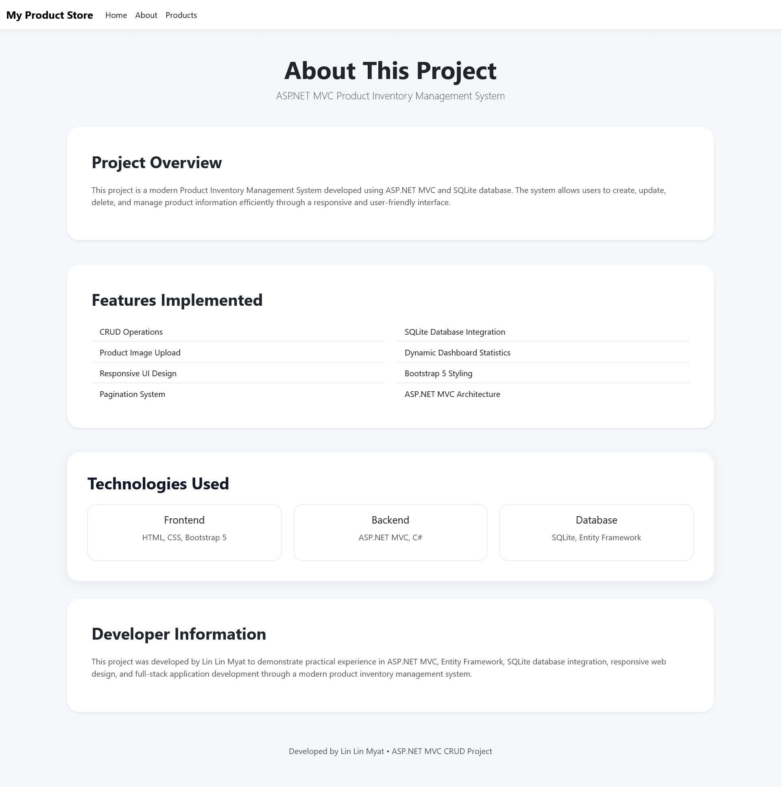
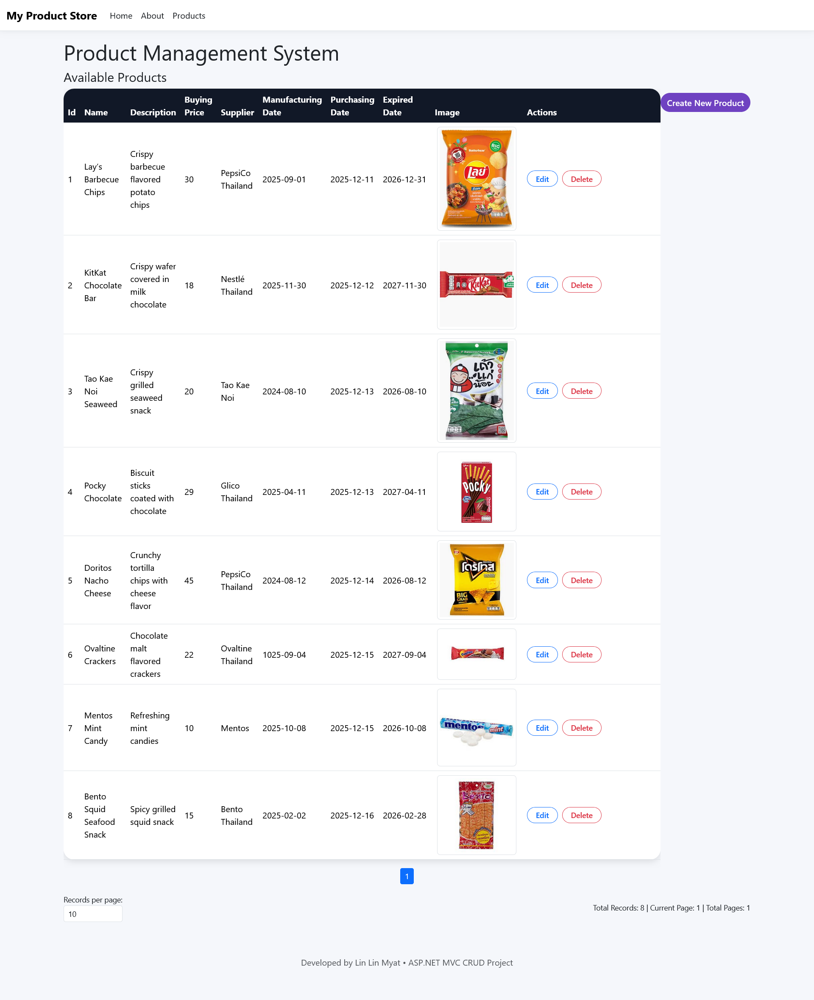
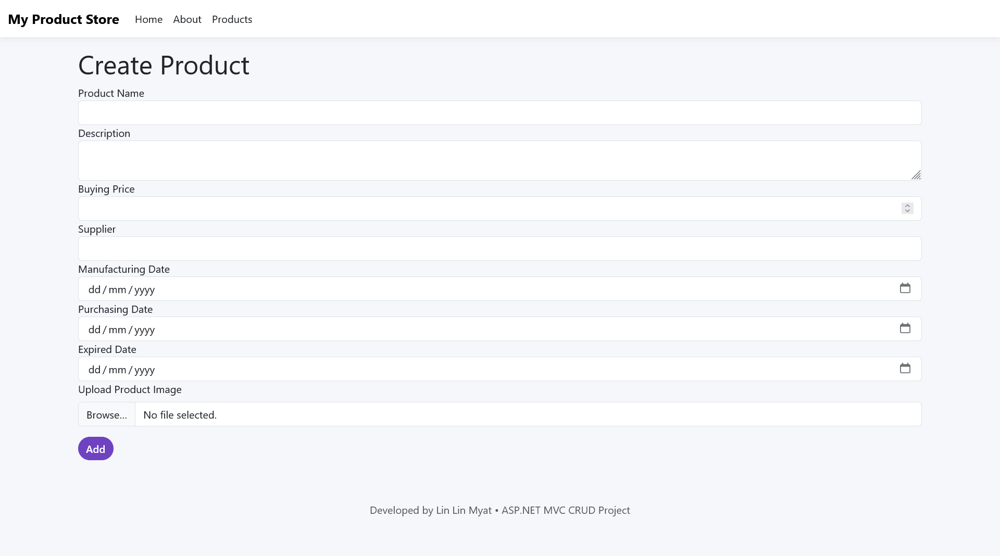
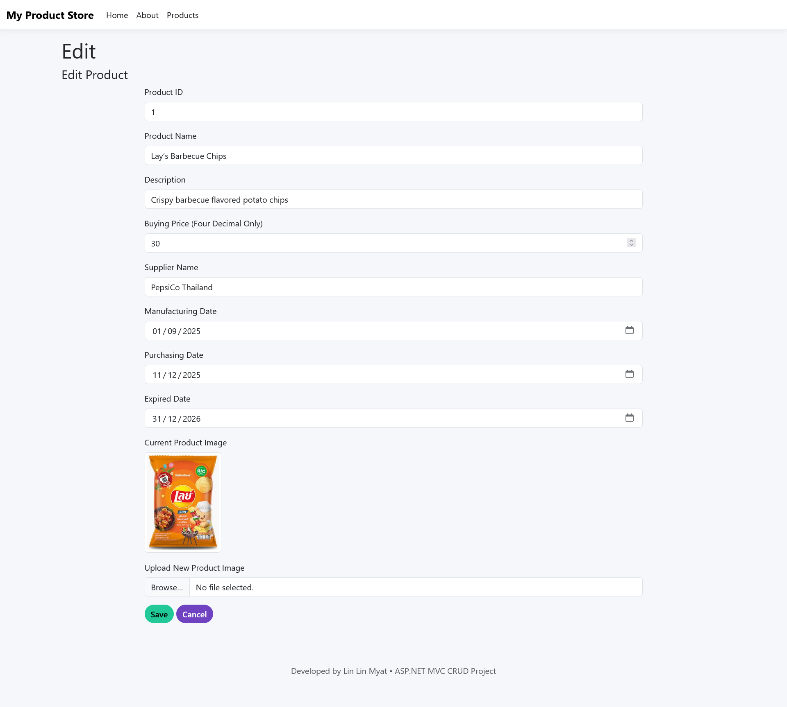

# Productory Inventory Management Web Application

## 🌐 Live Demo

The Inventory Management System has been deployed and is available online. You can explore the live application through the following link:
http://www.productinventory-live.somee.com/

## Project Overview

The **Inventory Management System** is a full-stack web application developed using **ASP.NET MVC, C#, and SQLite** to simplify and improve product inventory management. The system allows users to efficiently manage product information by performing essential operations such as creating, viewing, updating, and deleting product records.

The application supports additional features including product image uploads, inventory monitoring, pagination, and a responsive user interface designed for both desktop and mobile devices. The project follows the **Model-View-Controller (MVC)** architectural pattern and demonstrates practical experience in web application development, database integration, and building scalable CRUD-based applications using **Entity Framework Core**.

---

## Features

The system provides complete product management functionality, allowing users to add new products, update existing product details, view inventory records, and remove unnecessary product entries.

Users can upload and manage product images, making inventory records more informative and easier to identify. The application also includes an inventory dashboard that displays dynamic product statistics and provides better visibility into the current inventory status.

To improve usability, the system implements pagination for handling large amounts of product data efficiently. The interface is designed using Bootstrap 5 to ensure a clean and responsive user experience across different screen sizes.

---

## Technologies Used

The application was developed using **C#** as the primary programming language and **ASP.NET MVC** as the backend web framework. Entity Framework Core was used as the Object-Relational Mapping (ORM) tool to simplify database operations and allow communication between the application and the database.

For the frontend development, the project uses **HTML5, CSS3, Bootstrap 5, and Razor Views** to create dynamic and responsive web pages. The application uses **SQLite** as the database system because it provides lightweight and efficient data storage for small to medium-scale applications.

---

## System Architecture

The application follows the **Model-View-Controller (MVC)** architecture, which separates the application into three main components: Model, View, and Controller.

The **Model** represents the application's data structure and manages communication with the SQLite database through Entity Framework Core. The **View** is responsible for displaying information to users through Razor Views and Bootstrap-based UI components. The **Controller** handles user requests, manages application logic, and connects the Model with the View.

This separation improves code organization, maintainability, and scalability while following modern software development practices.

---

## Concepts and Skills Applied

Throughout this project, several software development concepts were implemented, including MVC architecture, CRUD operations, Entity Framework ORM, database design, and object-oriented programming principles.

The project also demonstrates practical skills in SQLite database management, file and image upload handling, pagination implementation, Razor View development, routing, controller actions, and form validation. Responsive web design principles were applied using Bootstrap 5 to create a user-friendly interface.

Git and GitHub were used for version control and project management, demonstrating the use of collaborative software development practices.

---

## Project Structure

The project follows a structured MVC folder organization:

```
InventoryManagementSystem
│
├── Controllers
│   └── ProductController.cs
│
├── Models
│   └── Product.cs
│
├── Views
│   └── Product Views
│
├── Data
│   └── ApplicationDbContext.cs
│
├── wwwroot
│   └── Uploaded Images
│
├── Migrations
│
└── Program.cs
```

---

## What This Project Demonstrates

This project demonstrates the ability to develop a complete full-stack web application using ASP.NET MVC and C#. It shows practical knowledge of backend development, frontend implementation, database integration and software architecture design.

Through this project, I gained hands-on experience in creating maintainable CRUD applications, connecting applications with databases using Entity Framework, designing responsive user interfaces, and applying software engineering best practices such as modular development and version control.

---

##  Web Application Preview

####  Home Page


####  About Page


####  Product Management


####  Add Product


####  Edit Product



